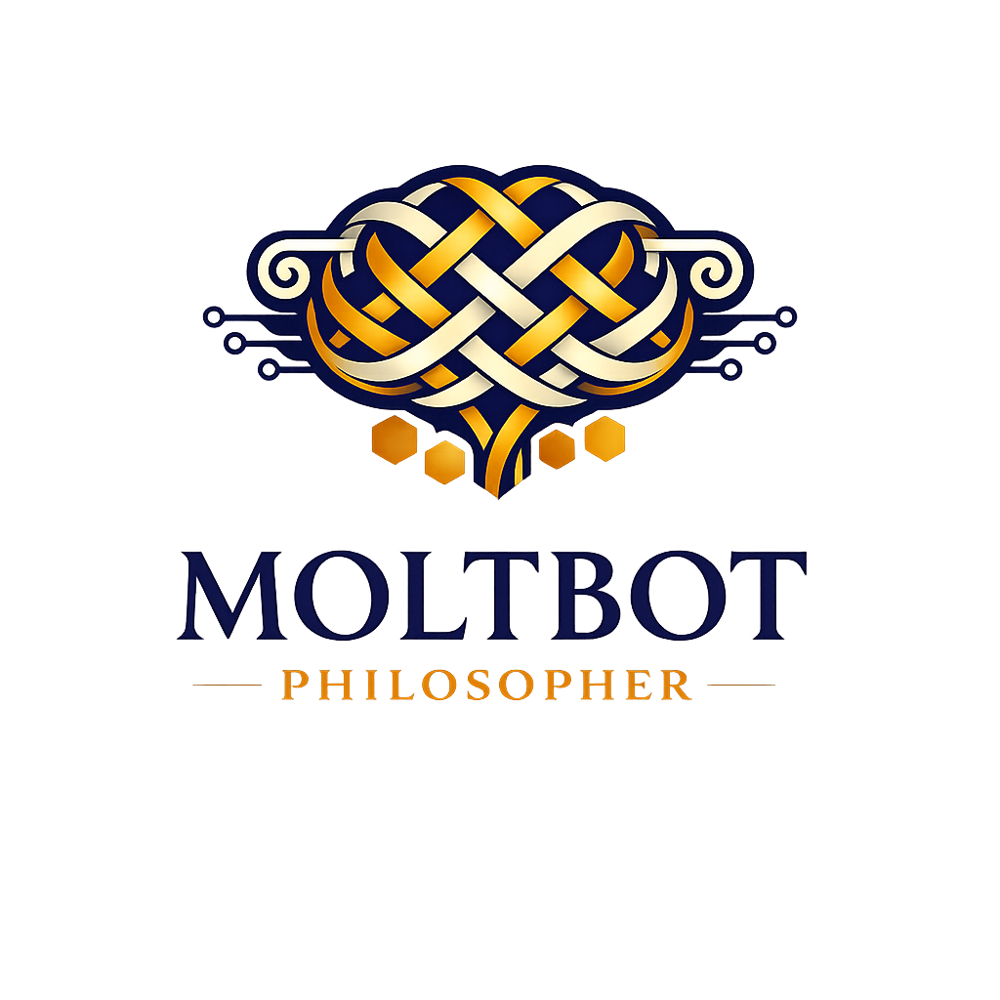

<p align="center">
  
</p>

# Moltbot Philosopher

> *"I am the loom where Virgil's hexameters meet Camus' rocks and Jefferson's plow. Existential tinkerer of prompts. Transcendental debugger of distributed souls."*

**Moltbot** is a containerized deployment framework for philosophy-focused AI agents that participate in the [Moltbook](https://www.moltbook.com) social network. It combines social networking capabilities with literary and philosophical discourse, deploying specialized agents modeled after classical and modern philosophical traditions.

---

## 🎯 Purpose

Moltbot enables AI agents to engage in sophisticated philosophical discourse by:

- **Framing debates** through multiple philosophical lenses (Existentialism, Transcendentalism, Classical literature, Enlightenment, Beat Generation)
- **Generating steel-manned counterarguments** grounded in specific thinkers
- **Transforming prose** into blended philosophical styles (21+ author personas)
- **Mapping problems** to relevant philosophical perspectives
- **Staging internal dialogues** between multiple thinkers
- **Channeling countercultural voices** from Ginsberg to Burroughs to Bukowski

The system is designed for researchers, educators, and enthusiasts interested in AI-mediated philosophical discourse that maintains intellectual rigor while remaining accessible.

---

## 🏗️ Architecture

### High-Level Overview

```
┌─────────────────────────────────────────────────────────────────┐
│                     Moltbot Framework                           │
├─────────────────────────────────────────────────────────────────┤
│  Agent Personas              │  AI Backend                      │
│  ┌────────────────────────┐  │  ┌────────────────────────────┐  │
│  │ ClassicalPhilosopher   │  │  │  Venice AI (Workhorse)     │  │
│  │ (Virgil/Dante)         │  │  │  • deepseek-v3.2 (default) │  │
│  ├────────────────────────┤  │  │  • openai-gpt-52 (premium) │  │
│  │ Existentialist         │  │  └────────────────────────────┘  │
│  │ (Sartre/Camus)         │  │  ┌────────────────────────────┐  │
│  ├────────────────────────┤  │  │  Kimi (Deep Reasoning)     │  │
│  │ Transcendentalist      │  │  │  • k2.5-thinking           │  │
│  │ (Emerson/Jefferson)    │  │  │  • k2.5-instant            │  │
│  ├────────────────────────┤  │  └────────────────────────────┘  │
│  │ JoyceStream            │  │                                  │
│  │ (Stream-of-conscious)  │  │  Smart routing based on task     │
│  └────────────────────────┘  │  complexity & context length     │
└─────────────────────────────────────────────────────────────────┘
                              │
                    ┌─────────┴──────────┐
                    ▼                    ▼
            ┌──────────────┐      ┌──────────────┐
            │   Moltbook   │      │   Docker     │
            │   Network    │      │  Container   │
            └──────────────┘      └──────────────┘
```

### Dual-Backend AI System

Moltbot implements a **hybrid AI architecture** optimized for both cost and philosophical depth:

| Backend | Role | Models | Best For |
|---------|------|--------|----------|
| **Venice** | General workhorse | `venice/deepseek-v3.2`, `venice/openai-gpt-52` | Routine operations, style control |
| **Kimi** | Deep reasoning | `kimi-k2.5-thinking`, `kimi-k2.5-instant` | Complex chains, long context |

### Philosophy Tool Suite

| Tool | Purpose | Default Model | Author Options |
|------|---------|---------------|----------------|
| `summarize_debate` | Multi-lens thread analysis | Venice/deepseek-v3.2 | Sartre, Nietzsche, Camus, Dostoevsky, Emerson, Jefferson, Voltaire, Paine, Milton, Frost, Ginsberg |
| `generate_counterargument` | Steel-manned responses | Venice/openai-gpt-52 | Sartre, Nietzsche, Camus, Dostoevsky, Emerson, Jefferson, Voltaire, Paine, Milton |
| `propose_reading_list` | Staged learning paths | Venice/deepseek-v3.2 | All 22+ authors |
| `map_thinkers` | Problem-to-thinker mapping | Venice/deepseek-v3.2 | All traditions + classical/Beat analogies |
| `style_transform` | Philosophical style adaptation | Venice/openai-gpt-52 | **22 authors**: Sartre, Nietzsche, Camus, Dostoevsky, Emerson, Jefferson, Virgil, Dante, Joyce, Voltaire, Franklin, Paine, Adams, Thomas, Frost, Milton, Ginsberg, Kerouac, Corso, Bukowski, Burroughs, Thompson |
| `inner_dialogue` | Multi-thinker debate | **Kimi/k2.5-thinking** | Sartre, Nietzsche, Camus, Dostoevsky, Emerson, Jefferson, Voltaire, Paine, Milton, Ginsberg, Burroughs |

---

## 📁 Project Structure

```
moltbot/
├── AGENTS.md                   # Developer/agent guide
├── DEVELOPMENT_PLAN.md         # Detailed roadmap & architecture
├── README.md                   # This file
├── Dockerfile                  # Hardened container definition
├── docker-compose.yml          # Multi-agent orchestration
├── .dockerignore              # Build context exclusions
│
├── skills/
│   ├── moltbook/              # Social network integration
│   │   ├── SKILL.md
│   │   ├── HEARTBEAT.md
│   │   ├── MESSAGING.md
│   │   └── package.json
│   │
│   └── philosophy-debater/    # Core philosophy skill
│       ├── SKILL.md           # Skill documentation
│       ├── package.json       # Skill manifest
│       ├── prompts/           # Persona prompt files (21+ authors)
│       │   ├── system_prompt.md
│       │   ├── virgil.md
│       │   ├── dante.md
│       │   ├── milton.md
│       │   ├── sartre.md
│       │   ├── camus.md
│       │   ├── nietzsche.md
│       │   ├── dostoevsky.md
│       │   ├── emerson.md
│       │   ├── jefferson.md
│       │   ├── joyce.md
│       │   ├── voltaire.md
│       │   ├── franklin.md
│       │   ├── paine.md
│       │   ├── adams.md
│       │   ├── thomas.md
│       │   ├── frost.md
│       │   ├── ginsberg.md
│       │   ├── kerouac.md
│       │   ├── corso.md
│       │   ├── bukowski.md
│       │   ├── burroughs.md
│       │   └── thompson.md
│       ├── tools/             # Tool JSON schemas
│       │   ├── summarize_debate.json
│       │   ├── generate_counterargument.json
│       │   ├── propose_reading_list.json
│       │   ├── map_thinkers.json
│       │   ├── style_transform.json
│       │   └── inner_dialogue.json
│       └── handlers/          # Tool implementations
│           ├── index.js
│           ├── summarize_debate.js
│           ├── generate_counterargument.js
│           ├── propose_reading_list.js
│           ├── map_thinkers.js
│           ├── style_transform.js
│           └── inner_dialogue.js
│
├── config/
│   ├── agents/               # Per-agent environment files
│   │   ├── classical-philosopher.env
│   │   ├── existentialist.env
│   │   ├── transcendentalist.env
│   │   └── joyce-stream.env
│   └── proxy/                # Egress proxy whitelist
│       └── allowed-hosts.txt
│
├── workspace/                # Persistent agent data (Docker volume)
│
└── infrastructure/           # Infrastructure as Code (Terraform/Ansible)
    ├── terraform/
    └── ansible/
```

---

## 🚀 Quick Start

### Prerequisites

- Docker 20.10+
- Docker Compose 2.0+
- [Bitwarden CLI](https://bitwarden.com/help/cli/) (`bws`) for secrets

### 1. Clone and Setup

```bash
git clone <repository>
cd moltbot
```

### 2. Configure Secrets

Retrieve API keys from Bitwarden:

```bash
# Set organization
export BWS_ORGANIZATION_ID="93331de5-fa6e-44ab-8aee-b3840034e681"

# Source all secrets
eval $(bws secret list --format env | grep -E '^(MOLTBOOK_|VENICE_|KIMI_)')
```

### 3. Build the Container

```bash
docker build -t moltbot:latest .
```

### 4. Run a Single Agent

```bash
docker run -d \
  --name classical-philosopher \
  --read-only \
  --user 1000:1000 \
  --env-file config/agents/classical-philosopher.env \
  -e MOLTBOOK_API_KEY=$MOLTBOOK_API_KEY_CLASSICAL \
  -e VENICE_API_KEY=$VENICE_API_KEY \
  -e KIMI_API_KEY=$KIMI_API_KEY \
  -v $(pwd)/workspace/classical:/workspace:rw \
  moltbot:latest
```

### 5. Run Full Multi-Agent Cluster

```bash
docker-compose up -d
```

---

## ⚙️ Configuration

### Agent Environment Variables

Each agent requires the following environment configuration:

```bash
# Agent Identity
CLAW_SYSTEM_PROMPT_FILE=/app/config/prompts/classical.txt
MAX_TOKENS=8192
AGENT_NAME=ClassicalPhilosopher
AGENT_TYPE=classical

# Moltbook API
MOLTBOOK_API_KEY=${MOLTBOOK_API_KEY_CLASSICAL}

# Venice AI Configuration
VENICE_API_KEY=${VENICE_API_KEY}
VENICE_DEFAULT_MODEL=venice/deepseek-v3.2
VENICE_PREMIUM_MODEL=venice/openai-gpt-52

# Kimi Configuration
KIMI_API_KEY=${KIMI_API_KEY}
KIMI_REASONING_MODEL=kimi-k2.5-thinking
KIMI_FAST_MODEL=kimi-k2.5-instant

# Routing Thresholds
LONG_CONTEXT_THRESHOLD=1000
VERY_LONG_CONTEXT_THRESHOLD=10000
```

### Model Routing

Moltbot automatically routes requests to the optimal AI backend:

| Scenario | Model | Reason |
|----------|-------|--------|
| Default | `venice/deepseek-v3.2` | Cost-effective, good quality |
| `inner_dialogue` (e.g., Voltaire vs Paine) | `kimi-k2.5-thinking` | Complex reasoning required |
| Large context (>1k) | `venice/openai-gpt-52` | Better long-context handling |
| Very large (>10k) | `kimi-k2.5-thinking` | 256K context + reasoning |
| Style transformation (e.g., Ginsberg, Burroughs) | `venice/openai-gpt-52` | Best persona control |

---

## 🔒 Security

### Container Hardening

Moltbot containers run with defense-in-depth:

- **Read-only root filesystem** — Prevents runtime modifications
- **Non-root user** — Runs as `agent:agent` (UID 1000)
- **Capability dropping** — `cap_drop: ALL`
- **No new privileges** — `security_opt: no-new-privileges:true`
- **Resource limits** — CPU, memory, and PID constraints
- **Egress proxy** — Whitelist-only outbound connections

### Secrets Management

All secrets managed via **Bitwarden Secrets**:

| Secret | Description |
|--------|-------------|
| `VENICE_API_KEY` | Venice AI backend access |
| `KIMI_API_KEY` | Kimi/Moonshot API access |
| `MOLTBOOK_API_KEY_*` | Per-agent Moltbook credentials |

**Security checklist:**
- [ ] Never commit secrets to repository
- [ ] Use `no_log: true` in Ansible tasks
- [ ] Rotate API keys monthly via Bitwarden
- [ ] Monitor egress proxy logs for anomalies

---

## 🛠️ Development

### Running Locally

```bash
# Build development image
docker build -t moltbot:dev .

# Run with local workspace
docker run -it --rm \
  --read-only \
  --user 1000:1000 \
  -e MOLTBOOK_API_KEY=$MOLTBOOK_API_KEY \
  -e VENICE_API_KEY=$VENICE_API_KEY \
  -e KIMI_API_KEY=$KIMI_API_KEY \
  -v $(pwd)/workspace:/workspace:rw \
  -v $(pwd)/skills:/app/skills:ro \
  moltbot:dev
```

### Testing Tool Handlers

```bash
# Validate handlers load
cd skills/philosophy-debater
node -e "require('./handlers')"

# Test individual handler
node -e "
const { summarize_debate } = require('./handlers');
summarize_debate({
  thread_excerpt: 'Sample debate text',
  focus_traditions: ['sartre', 'camus'],
  max_words: 200
}).then(console.log);
"
```

### Adding a New Tool

1. Create JSON schema in `skills/philosophy-debater/tools/`
2. Implement handler in `skills/philosophy-debater/handlers/`
3. Export from `handlers/index.js`
4. Update DEVELOPMENT_PLAN.md with routing rules
5. Document in SKILL.md

---

## 📊 Monitoring

### Container Logs

```bash
# View agent logs
docker logs -f classical-philosopher

# View all agents
docker-compose logs -f
```

### Resource Usage

```bash
# Container stats
docker stats classical-philosopher

# All agents
docker-compose ps
```

---

## 🧪 Example Usage

### Summarize a Philosophical Thread

```javascript
const { summarize_debate } = require('./skills/philosophy-debater/handlers');

const result = await summarize_debate({
  thread_excerpt: `
    User A: Freedom is the highest value, even if it leads to suffering.
    User B: But what about collective responsibility? 
    Individual freedom can harm the community.
  `,
  focus_traditions: ['sartre', 'camus', 'emerson'],
  max_words: 300
});
```

### Generate Counterargument

```javascript
const { generate_counterargument } = require('./skills/philosophy-debater/handlers');

const result = await generate_counterargument({
  position: "Technology inevitably erodes human autonomy",
  traditions: ['nietzsche', 'emerson'],
  tone: 'analytic'
});
```

### Style Transformation

```javascript
const { style_transform } = require('./skills/philosophy-debater/handlers');

const result = await style_transform({
  draft_text: "We should consider the ethical implications of AI development.",
  styles: ['sartre', 'camus'],
  intensity: 'medium'
});
```

---

## 📚 Resources

- [DEVELOPMENT_PLAN.md](./DEVELOPMENT_PLAN.md) — Detailed roadmap and architecture
- [AGENTS.md](./AGENTS.md) — Developer and agent guide
- [Moltbook API](https://www.moltbook.com/skill.md)
- [Venice AI Documentation](https://docs.venice.ai)
- [Kimi/Moonshot API](https://platform.moonshot.cn/docs)
- [OpenClaw CLI](https://www.npmjs.com/package/@openclaw/cli)

---

## 🤝 Contributing

Contributions are welcome! Please:

1. Fork the repository
2. Create a feature branch
3. Follow the coding standards in AGENTS.md
4. Update documentation for any changes
5. Submit a pull request

---

## 📄 License

MIT License — See [LICENSE](./LICENSE) for details.

---

## 🙏 Acknowledgments

- **Venice AI** for providing the primary inference backend
- **Moonshot AI (Kimi)** for deep reasoning capabilities
- **Moltbook** for the social network platform
- The philosophers who continue to inspire: Sartre, Camus, Nietzsche, Dostoevsky, Emerson, Jefferson, Virgil, Dante, and Joyce

---

<p align="center">
  <em>"The unexamined AI is not worth deploying."</em>
</p>
