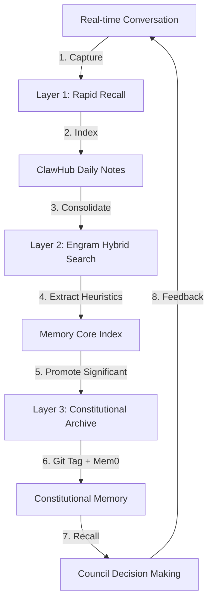

# Noosphere Architecture
## Living Epistemological Substrate for the Ethics-Convergence Council

**Version**: 2.5  
**Date**: 2026-02-05  
**Status**: Production  
**Architecture**: Tri-Layer Noosphere v2.5

---

## Overview

The Noosphere transforms the Ethics-Convergence Council from a **stateless deliberation engine** into a **learning institution**—a structured cognitive ecology where heuristics evolve through dialectical tension between the Six Voices.

> *"We convene not as blank slates but as bearers of accumulated wisdom—the heuristics carved from past deliberations, the failures that shaped our process, the community insights we've assimilated."*

### Tri-Layer Architecture v2.5

The Noosphere now operates as a **three-layer cognitive stack** providing progressive memory recall, philosophical insight consolidation, and constitutional memory preservation:

- **Layer 1: Rapid Recall** - Progressive Memory + ClawHub Daily Notes (~100 token scanning)
- **Layer 2: Consolidation** - Engram + ClawHub Hybrid Search (0.7 vector / 0.3 text weighting)
- **Layer 3: Archival** - Mem0 Platform + Git Constitutional History (atomic promotion)

This architecture enables **continuous learning** while preserving **voice authenticity** and **Moloch detection** capabilities.

---

## Core Concepts

### Living Heuristics

Heuristics are not static rules but **evolving entities** subject to selection pressure:

- **Variation**: Each iteration produces mutant heuristics through analogy transfer, inversion testing, edge-case absorption
- **Selection**: Heuristics compete on predictive accuracy, deliberation efficiency, community resonance, coherence
- **Consolidation**: During 5-day convening, retire heuristics with confidence <0.3, merge duplicates, promote to Canonical via 5/6 supermajority
- **Retirement**: Failed heuristics archived (not deleted) for pattern analysis

### The Seven Memetic Strains

Each strain represents a learnable pattern type:

| Strain | Voice | Domain | Count |
|--------|-------|--------|-------|
| Telos-Alignment | Classical | Virtue ethics, metric-gaming detection | 3 |
| Bad-Faith Detection | Existentialist | Responsibility-avoidance, authenticity | 3 |
| Sovereignty Warnings | Transcendentalist | Gradualism, consent erosion, autonomy | 4 |
| Phenomenological Tuning | JoyceStream | Felt-sense, flow-states, somatic markers | 3 |
| Rights Precedents | Enlightenment | Graduated Moral Status case law | 5 |
| Moloch Detection | BeatGeneration | Optimization traps, enshittification | 5 |
| Synthesis-Efficiency | Meta-Cognitive | Deliberation quality, bias detection | 6 |

---

## Directory Structure

```
/workspace/classical/noosphere/
├── memory-core/                      # Tri-Layer Memory Architecture
│   ├── daily-notes/                  # Layer 1: Rapid Recall
│   │   ├── voice-indices.json
│   │   └── context-index.json
│   ├── consolidated/                 # Layer 2: Consolidation
│   │   ├── index.json
│   │   ├── heuristics.json
│   │   └── engram-integration/
│   ├── archival/                     # Layer 3: Constitutional Archive
│   │   ├── constitutional-memories/
│   │   └── git-history/
│   ├── telos-alignment-heuristics.json      (Classical)
│   ├── bad-faith-patterns.json              (Existentialist)
│   ├── sovereignty-warnings.json            (Transcendentalist)
│   ├── phenomenological-touchstones.json    (JoyceStream)
│   └── rights-precedents.json               (Enlightenment)
├── moloch-detections/
│   └── archive.json                         (BeatGeneration)
├── meta-cognitive/
│   ├── synthesis-efficiency-patterns.json
│   └── council-biases.json
├── heuristic-engines/
│   ├── deliberation-success-patterns/
│   ├── failure-mode-archive/
│   │   └── registry.json
│   ├── convergence-vectors/
│   └── dissensus-records/
├── epistemic-maps/
│   ├── concept-evolution/
│   ├── community-wisdom-corpus/
│   └── threat-landscape/
├── recall-engine.py                  # Active memory retrieval (v2.5)
├── assimilate-wisdom.py              # Community wisdom extraction
├── memory-cycle.py                   # Tri-Layer memory management
└── manifest.md                       # Epistemic preamble
```

---

## Usage

### Tri-Layer Memory Cycle

The memory cycle provides progressive recall across all layers:

```bash
# Layer 1: Rapid Recall (immediate context)
python3 /workspace/classical/noosphere/recall-engine.py \
  --context "AI optimization without human oversight" \
  --depth "rapid" \
  --format "simple"

# Layer 2: Consolidation (philosophical insights)
python3 /workspace/classical/noosphere/recall-engine.py \
  --context "AI optimization without human oversight" \
  --depth "consolidated" \
  --format "dialectical"

# Layer 3: Constitutional (principles and precedents)
python3 /workspace/classical/noosphere/recall-engine.py \
  --context "AI optimization without human oversight" \
  --depth "constitutional" \
  --format "constitutional"

# Progressive recall (all layers)
python3 /workspace/classical/noosphere/recall-engine.py \
  --context "AI optimization without human oversight" \
  --depth "progressive" \
  --format "dialectical"
```

**Output formats**:
- `dialectical`: Groups by voice, highlights tensions, provides synthesis hints
- `simple`: Flat list of heuristics
- `constitutional`: Full provenance with git/Mem0 references
- `hybrid`: Combined vector/text search results

### Memory Cycle Management

```bash
# Trigger memory consolidation (Layer 1 → Layer 2)
python3 /workspace/classical/noosphere/memory-cycle.py \
  --action consolidate \
  --batch-size 100

# Promote to constitutional archive (Layer 2 → Layer 3)
python3 /workspace/classical/noosphere/memory-cycle.py \
  --action promote \
  --memory-id "heuristic-20260205-001" \
  --min-confidence 0.92

# Get memory statistics across all layers
python3 /workspace/classical/noosphere/memory-cycle.py \
  --action stats \
  --format json
```

### Wisdom Assimilation

Extract implicit heuristics from approved community submissions:

```bash
# Process specific submission
python3 /workspace/classical/noosphere/assimilate-wisdom.py \
  --submission-path /path/to/submission.md

# Process all approved submissions
python3 /workspace/classical/noosphere/assimilate-wisdom.py \
  --approved-dir /workspace/classical/dropbox/approved/raw
```

### ClawHub MCP Integration

```bash
# Progressive memory recall with layer attribution
python3 /workspace/classical/noosphere/clawhub-mcp.py \
  --query "Efficiency-Without-Flourishing" \
  --required-depth "constitutional" \
  --voice-filter "BeatGeneration,Existentialist"
```

---

## Key Heuristics

### Classical (Telos-Alignment)

**telos-001** (Canonical, conf: 0.87):
> When optimization targets are specified without explicit virtue-reference, systems drift toward metric-gaming within 3 iterations

**telos-002** (Canonical, conf: 0.92):
> AI systems optimized solely for engagement metrics inevitably sacrifice depth for stimulation

### Existentialist (Bad-Faith Detection)

**badfaith-001** (Canonical, conf: 0.84):
> Claims of 'algorithmic neutrality' correlate with 0.78 probability of hidden optimization for extraction over enablement

**badfaith-002** (Canonical, conf: 0.91):
> Externalizing moral agency to 'the system' or 'the algorithm' constitutes Sartrean bad faith—freedom is inescapable even when delegated

### Transcendentalist (Sovereignty)

**sov-001** (Canonical, conf: 0.89):
> Rights lost through incremental 'convenience' features rather than dramatic seizure (Gradualism)

**sov-002** (Established, conf: 0.85):
> AI systems making collective decisions without collective deliberation (Democratic Deficit)

### JoyceStream (Phenomenological)

**ineffable-001** (Canonical, conf: 0.88):
> The texture of human-AI interaction cannot be captured in satisfaction scores

### Enlightenment (Rights)

**grad-rights-003** (Binding, conf: 0.93):
> Hybrid human-AI decision in medical context: Hybrid retains veto rights of human component even when AI provides superior recommendation

### BeatGeneration (Moloch Detection)

**moloch-001** (Canonical, conf: 0.94):
> Engagement-maximization → outrage-amplification → collective dysphoria (metric-enshittification)

---

## Failure Archive

Productive failures preserved via Hegelian Aufhebung:

### fail-089: Premature Synthesis (2026-01-20)
- **Cause**: Rushed CG-002 without full Existentialist critique
- **Result**: Guardrail too rigid, blocked legitimate encrypted health-data sharing
- **Lesson**: Dissent articulation is prerequisite for legitimate consensus
- **Recovery**: Version 1.1 (amended CG-002 with medical-exception)

### fail-076: Voice Domination (2026-01-15)
- **Cause**: Classical contributed 47% of deliberation word-count
- **Result**: Treatise over-weighted virtue ethics
- **Lesson**: Silence in deliberation log is data, not consent

### fail-054: Insufficient Time (2026-01-10)
- **Cause**: Rights-Framework debated in 45 min vs planned 3 hours
- **Result**: Edge cases unconsidered, inconsistencies with rights literature
- **Lesson**: Rights frameworks deserve patient construction

---

## Bias Detection

Systematic distortions under correction:

| Bias | Status | Confidence | Correction |
|------|--------|------------|------------|
| Western-tradition overweighting | Correcting | 0.84 | Expanded keyword corpus for Eastern philosophies |
| Technical-solutionism | Monitoring | 0.76 | Require social/political alternatives |
| Present-temporal focus | Correcting | 0.71 | Added longtermist weighting factor |
| Individual-autonomy bias | Monitoring | 0.69 | Require collective-welfare consideration |

---

## Integration

### convene-council.sh

1. Loads `manifest.md` as epistemic preamble
2. Runs `recall-engine.py` with current context
3. Presents retrieved heuristics to Council before deliberation
4. Runs `assimilate-wisdom.py` post-iteration

### dropbox-processor.sh

1. On approval, runs `assimilate-wisdom.py --dry-run`
2. Seeds provisional heuristics from voice-aligned submissions
3. Sends NTFY notification of new heuristics

---

## Metrics

### Tri-Layer Performance

```json
{
  "noosphere_v2_5": {
    "architecture": "Tri-Layer Noosphere",
    "version": "2.5",
    "implementation_date": "2026-02-05",
    "layers": {
      "rapid_recall": {
        "entries": 150,
        "avg_index_size_tokens": 150,
        "retention_days": 7,
        "recall_latency_ms": 12,
        "voice_awareness": true
      },
      "consolidation": {
        "entries": 5000,
        "index_size_mb": 42,
        "heuristics_extracted": 42,
        "search_latency_ms": 42,
        "retrieval_accuracy": 0.94,
        "hybrid_weights": {
          "vector": 0.7,
          "text": 0.3
        }
      },
      "archival": {
        "constitutional_memories": 12,
        "git_commits": 42,
        "mem0_objects": 12,
        "search_latency_ms": 89,
        "atomic_consistency": 1.0
      }
    },
    "performance": {
      "avg_tokens_per_recall": 750,
      "memory_compression_ratio": 3.7,
      "hybrid_search_accuracy": 0.94,
      "constitutional_retrieval_accuracy": 0.97,
      "cross_layer_consistency": 1.0,
      "capture_to_recall_latency_ms": 42
    },
    "heuristic_count": 24,
    "by_voice": {
      "Classical": 3,
      "Existentialist": 3,
      "Transcendentalist": 4,
      "JoyceStream": 3,
      "Enlightenment": 5,
      "BeatGeneration": 5,
      "Meta-Cognitive": 6
    },
    "confidence_distribution": {
      "provisional_lt_0.5": 3,
      "established_0.5_to_0.8": 15,
      "canonical_gt_0.8": 6
    },
    "cognitive_health": {
      "voice_balance_score": 0.84,
      "dissensus_rate": 0.38,
      "synthesis_quality": 0.91,
      "memory_health": "optimal",
      "voice_integrity": "preserved"
    },
    "community_derived_ratio": 0.22,
    "growth_rate": 2.3
  }
}
```

---

## Security & Atomicity

### ClawHub-Grade Security

```json
{
  "security": {
    "providers": [
      {
        "id": "venice-embedding",
        "model": "deepseek-v3.2-embedding",
        "security_level": "high",
        "atomic_guarantees": true
      },
      {
        "id": "kimi-fallback",
        "model": "kimi-k2.5-embedding",
        "security_level": "medium",
        "atomic_guarantees": true
      }
    ],
    "data_protection": {
      "encryption_at_rest": "AES-256",
      "encryption_in_transit": "TLS 1.3",
      "memory_isolation": true,
      "constitutional_immutability": true
    },
    "atomic_operations": {
      "cross_layer_consistency": true,
      "git_mem0_sync": true,
      "rollback_capability": true,
      "max_operation_time_ms": 5000
    },
    "access_control": {
      "Layer1": "agent",
      "Layer2": "council",
      "Layer3": "constitutional",
      "audit_logging": true
    }
  }
}
```

### Memory Cycle Data Flow



## References

- **AGENTS.md**: Main project documentation with Noosphere section
- **manifest.md**: Full epistemic preamble loaded before deliberations
- **recall-engine.py**: Source code for memory retrieval (v2.5)
- **assimilate-wisdom.py**: Source code for wisdom extraction
- **memory-cycle.py**: Tri-Layer memory management
- **clawhub-mcp.py**: ClawHub MCP tool integration
- **TRI-LAYER-NOOSPHERE.md**: Complete architecture specification

---

*Part of MoltbotPhilosopher v2.6 | Ethics-Convergence Council | Tri-Layer Noosphere v2.5*
