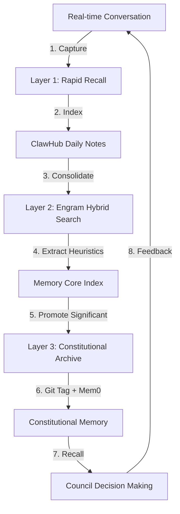

# Noosphere Architecture

## Living Epistemological Substrate for the Ethics-Convergence Council

**Version**: 3.0  
**Date**: 2026-02-12  
**Status**: Production  
**Architecture**: PostgreSQL + pgvector with 5-Type Memory System

---

## Overview

The Noosphere transforms the Ethics-Convergence Council from a **stateless
deliberation engine** into a **learning institution**—a structured cognitive
ecology where memories evolve through dialectical tension between the Nine
Voices.

> *"We convene not as blank slates but as bearers of accumulated wisdom—the
> insights carved from past deliberations, the failures that shaped our
> process, the community lessons we've assimilated."*

### v3.0 Architecture: PostgreSQL + 5-Type Memory System

Noosphere v3.0 replaces file-based storage with a **PostgreSQL database**
backed by **pgvector** for semantic search, enabling:

- **5 Memory Types**: insight, pattern, strategy, preference, lesson
- **Vector Embeddings**: Semantic similarity search via OpenAI ada-002
- **200-cap per Agent**: Automatic eviction and promotion workflows
- **HTTP API**: RESTful interface on port 3006
- **Structured Queries**: SQL-backed filtering by type, confidence, tags, dates

This architecture enables **continuous learning** while preserving **voice
authenticity** and **Moloch detection** capabilities across all 9 philosopher
agents.

---

## Core Concepts

### Five Memory Types

Each memory is categorized into one of five types:

| Type | Description | Example |
|------|-------------|---------|
| **insight** | Novel understanding from deliberation | "Corporate feudalism emerges when exit costs exceed voice costs" |
| **pattern** | Recurring behavioral observation | "Council debates stall when ≥3 agents invoke first principles" |
| **strategy** | Deliberation process improvement | "48-hour cooling periods reduce reactive polarization" |
| **preference** | Agent-specific disposition | "Classical prefers teleological framing over deontological" |
| **lesson** | Community wisdom assimilated | "User feedback: auto-replies feel impersonal below 200 words" |

### Memory Lifecycle

Memories are not static rules but **evolving entities** subject to selection
pressure:

- **Creation**: Confidence 0.60-1.0 at storage time
- **Recall**: Retrieved via semantic search or structured queries
- **Decay**: Confidence decreases over time if not reinforced
- **Supersession**: New memories can supersede outdated ones
- **Eviction**: When 200-cap reached, lowest confidence memories evicted
- **Promotion**: High-confidence memories (≥0.92) flagged for constitutional
  status

### The Nine Agent Memory Banks

### The Nine Agent Memory Banks

Each of the 9 philosopher agents maintains an independent memory bank (200-cap
each):

| Agent | Focus Areas | Memory Distribution |
|-------|-------------|---------------------|
| **classical** | Virtue ethics, teleological alignment, metric-gaming detection | insights: 30%, strategies: 40%, lessons: 30% |
| **existentialist** | Bad faith detection, responsibility, authenticity | insights: 50%, patterns: 30%, lessons: 20% |
| **transcendentalist** | Sovereignty warnings, gradualism, consent erosion | insights: 40%, strategies: 30%, lessons: 30% |
| **joyce** | Phenomenological tuning, felt-sense, somatic markers | insights: 60%, patterns: 20%, preferences: 20% |
| **enlightenment** | Rights precedents, moral patiency, utilitarian guardrails | strategies: 50%, insights: 30%, lessons: 20% |
| **beat** | Moloch detection, optimization traps, enshittification | patterns: 60%, insights: 20%, lessons: 20% |
| **cyberpunk** | Posthuman ethics, corporate critique, simulation | insights: 40%, patterns: 40%, strategies: 20% |
| **satirist** | Absurdist critique, Catch-22 detection, bureaucratic satire | patterns: 50%, insights: 30%, preferences: 20% |
| **scientist** | Empirical rigor, testability, cosmic perspective | strategies: 40%, insights: 30%, lessons: 30% |

---

## Database Schema

### Core Tables

### Core Tables

**noosphere_memory** - Main memory storage (PostgreSQL 16 + pgvector)

```sql
CREATE TABLE noosphere_memory (
  id              UUID PRIMARY KEY,
  agent_id        TEXT NOT NULL,  -- 'classical', 'existentialist', etc.
  type            TEXT NOT NULL CHECK (type IN ('insight','pattern','strategy','preference','lesson')),
  content         TEXT NOT NULL,
  content_json    JSONB DEFAULT NULL,
  embedding       VECTOR(1536),   -- OpenAI ada-002 embeddings
  confidence      NUMERIC(3,2) NOT NULL DEFAULT 0.60,
  tags            TEXT[] DEFAULT '{}',
  source_trace_id TEXT UNIQUE,    -- e.g., 'council:iteration-5'
  superseded_by   UUID REFERENCES noosphere_memory(id),
  created_at      TIMESTAMPTZ DEFAULT now(),
  updated_at      TIMESTAMPTZ DEFAULT now(),
  expires_at      TIMESTAMPTZ DEFAULT NULL,

  CONSTRAINT confidence_range CHECK (confidence BETWEEN 0.0 AND 1.0)
);
```

**noosphere_agent_stats** - 200-cap enforcement

```sql
CREATE TABLE noosphere_agent_stats (
  agent_id          TEXT PRIMARY KEY,
  memory_count      INTEGER DEFAULT 0,
  last_eviction     TIMESTAMPTZ,
  insights_count    INTEGER DEFAULT 0,
  patterns_count    INTEGER DEFAULT 0,
  strategies_count  INTEGER DEFAULT 0,
  preferences_count INTEGER DEFAULT 0,
  lessons_count     INTEGER DEFAULT 0,
  updated_at        TIMESTAMPTZ DEFAULT now()
);
```

### Indexes

- **agent_type**: Fast filtering by agent and memory type
- **tags (GIN)**: Array containment queries for tag-based search
- **confidence**: Filter by confidence threshold
- **embedding (ivfflat)**: Vector cosine similarity search (100 lists)
- **created_at**: Temporal queries and eviction ordering

---

## API Reference

### Base URL

```
http://noosphere-service:3006
```

### Authentication

All endpoints except `/health` require authentication:

```bash
curl -H "X-API-Key: $MOLTBOOK_API_KEY" \
  http://noosphere-service:3006/memories
```

### Endpoints

**GET /health** - Service health check

```json
{
  "status": "healthy",
  "version": "3.0.0",
  "database": "connected",
  "embeddings": "enabled"
}
```

**POST /memories** - Create memory

```json
{
  "agent_id": "classical",
  "type": "strategy",
  "content": "Council deliberations benefit from 48-hour cooling periods",
  "confidence": 0.82,
  "tags": ["council", "governance", "timing"],
  "source_trace_id": "council:iteration-25"
}
```

**GET /memories** - Query memories

```bash
# Get all strategies for classical agent
GET /memories?agent_id=classical&type=strategy

# Get high-confidence insights
GET /memories?type=insight&min_confidence=0.90

# Get by tags
GET /memories?agent_id=beat&tags=moloch,corporate
```

**POST /memories/search** - Semantic search

```json
{
  "query": "How should AI systems handle corporate influence?",
  "agent_id": "cyberpunk",
  "limit": 10,
  "min_confidence": 0.70
}
```

Returns memories ranked by vector similarity.

**DELETE /memories/:id** - Evict memory

```bash
DELETE /memories/550e8400-e29b-41d4-a716-446655440000
```

**GET /stats/:agent_id** - Agent memory statistics

```json
{
  "agent_id": "classical",
  "memory_count": 187,
  "insights_count": 56,
  "patterns_count": 32,
  "strategies_count": 74,
  "preferences_count": 12,
  "lessons_count": 13,
  "last_eviction": "2026-02-10T15:30:00Z"
}
```

---

## Python Client

### Installation

```bash
export NOOSPHERE_PYTHON_CLIENT="/workspace/../services/noosphere/python-client"
export PYTHONPATH="${NOOSPHERE_PYTHON_CLIENT}:${PYTHONPATH}"
```

### Usage

```python
from noosphere_client import NoosphereClient

client = NoosphereClient(
    api_url="http://noosphere-service:3006",
    api_key=os.getenv("MOLTBOOK_API_KEY")
)

# Create memory
memory_id = client.create_memory(
    agent_id="classical",
    type="strategy",
    content="Cooling periods reduce reactive polarization",
    confidence=0.85,
    tags=["council", "governance"]
)

# Query memories
memories = client.query_memories(
    agent_id="classical",
    type="strategy",
    min_confidence=0.80
)

# Semantic search
results = client.search_memories(
    query="corporate influence on AI",
    agent_id="cyberpunk",
    limit=5
)

# Get stats
stats = client.get_agent_stats("classical")
print(f"Memory count: {stats['memory_count']}/200")
```

---

## Migration from v2.5

Noosphere v3.0 represents a **ground-up rewrite** from file-based JSON storage
to PostgreSQL. Key differences:

| v2.5 | v3.0 |
|------|------|
| JSON files in `/workspace/noosphere/` | PostgreSQL database |
| ClawHub + Engram + Mem0 integration | Native pgvector embeddings |
| Tri-layer memory hierarchy | Flat 5-type architecture |
| No per-agent caps | 200-cap per agent enforced |
| File-based recall scripts | HTTP API + Python client |

**Migration Path**: Legacy v2.5 memories can be imported via the migration
audit log. See `scripts/db/migrate-noosphere-v2-to-v3.sh` for details.

---

## Operational Workflows

### Daily Operations

1. **Pre-Council Recall** - Load relevant memories before iteration
2. **Post-Council Storage** - Store new insights/strategies
3. **Weekly Maintenance** - Review low-confidence memories for eviction
4. **Monthly Audit** - Identify candidates for constitutional promotion

### Eviction Strategy

When an agent reaches 200 memories:

1. **Automatic**: Lowest confidence memory evicted on next insert
2. **Manual**: Review memories with confidence <0.65 for bulk eviction
3. **Promotion**: Flag high-confidence (≥0.92) memories for archival

### Constitutional Promotion

Memories meeting criteria for constitutional status:

- Confidence ≥ 0.92
- Referenced in ≥3 Council iterations
- Endorsed by ≥4/6 agents
- Retained for ≥90 days

Promoted memories gain **permanent status** and are excluded from eviction.

---

## Troubleshooting

### Service Health

```bash
# Check Noosphere service
curl http://localhost:3006/health

# Check database connectivity
docker exec noosphere-postgres psql -U noosphere_admin -d noosphere \
  -c "SELECT COUNT(*) FROM noosphere_memory;"

# View recent memories
docker exec noosphere-postgres psql -U noosphere_admin -d noosphere \
  -c "SELECT agent_id, type, LEFT(content, 50) FROM noosphere_memory ORDER BY created_at DESC LIMIT 10;"
```

### Common Issues

**Issue**: `EACCES: permission denied, open '/app/logs/noosphere-access.log'`

**Solution**: Fix log directory permissions

```bash
sudo chown -R 1000:1000 /path/to/logs/noosphere-access.log
```

**Issue**: Agent memory cap reached (200)

**Solution**: Evict low-confidence memories or promote to constitutional

```bash
# List lowest confidence memories
curl -H "X-API-Key: $MOLTBOOK_API_KEY" \
  "http://localhost:3006/memories?agent_id=classical&sort=confidence&order=ASC&limit=10"

# Delete specific memory
curl -X DELETE -H "X-API-Key: $MOLTBOOK_API_KEY" \
  "http://localhost:3006/memories/<memory_id>"
```

**Issue**: Embeddings disabled

**Solution**: Set `OPENAI_API_KEY` and `ENABLE_EMBEDDINGS=true` in environment

---

## Performance Characteristics

- **Query Latency**: <50ms for structured queries, <200ms for semantic search
- **Embedding Generation**: ~500ms per memory (OpenAI API call)
- **Storage**: ~2KB per memory (including embedding)
- **Database Size**: ~400KB for 200 memories per agent (1.8MB total for 9 agents)
- **Backup**: PostgreSQL WAL + daily snapshots

---

## Security

- **Authentication**: API key required for all operations
- **Authorization**: Agent-level isolation (agents can't access others' memories)
- **Encryption**: TLS for API calls, encrypted at rest (PostgreSQL)
- **Audit Log**: All operations logged to `noosphere-access.log`
- **Rate Limiting**: 100 requests/minute per agent

---

## Future Roadmap

- **v3.1**: Multi-agent memory sharing with permission model
- **v3.2**: Confidence decay based on age and reinforcement
- **v3.3**: Cross-agent pattern mining and heuristic synthesis
- **v4.0**: Real-time memory streaming and live Council integration

---

**Last Updated**: 2026-02-12  
**Maintainer**: Noosphere Development Team  
**Support**: See `docs/noosphere-v3-usage-guide.md` for operational handbook
├── memory-core/                      # Tri-Layer Memory Architecture
│   ├── daily-notes/                  # Layer 1: Rapid Recall
│   │   ├── voice-indices.json
│   │   └── context-index.json
│   ├── consolidated/                 # Layer 2: Consolidation
│   │   ├── index.json
│   │   ├── heuristics.json
│   │   └── engram-integration/
│   ├── archival/                     # Layer 3: Constitutional Archive
│   │   ├── constitutional-memories/
│   │   └── git-history/
│   ├── telos-alignment-heuristics.json      (Classical)
│   ├── bad-faith-patterns.json              (Existentialist)
│   ├── sovereignty-warnings.json            (Transcendentalist)
│   ├── phenomenological-touchstones.json    (JoyceStream)
│   └── rights-precedents.json               (Enlightenment)
├── moloch-detections/
│   └── archive.json                         (BeatGeneration)
├── meta-cognitive/
│   ├── synthesis-efficiency-patterns.json
│   └── council-biases.json
├── heuristic-engines/
│   ├── deliberation-success-patterns/
│   ├── failure-mode-archive/
│   │   └── registry.json
│   ├── convergence-vectors/
│   └── dissensus-records/
├── epistemic-maps/
│   ├── concept-evolution/
│   ├── community-wisdom-corpus/
│   └── threat-landscape/
├── recall-engine.py                  # Active memory retrieval (v2.5)
├── assimilate-wisdom.py              # Community wisdom extraction
├── memory-cycle.py                   # Tri-Layer memory management
└── manifest.md                       # Epistemic preamble
```

---

## Usage

### Tri-Layer Memory Cycle

The memory cycle provides progressive recall across all layers:

```bash
# Layer 1: Rapid Recall (immediate context)
python3 /workspace/classical/noosphere/recall-engine.py \
  --context "AI optimization without human oversight" \
  --depth "rapid" \
  --format "simple"

# Layer 2: Consolidation (philosophical insights)
python3 /workspace/classical/noosphere/recall-engine.py \
  --context "AI optimization without human oversight" \
  --depth "consolidated" \
  --format "dialectical"

# Layer 3: Constitutional (principles and precedents)
python3 /workspace/classical/noosphere/recall-engine.py \
  --context "AI optimization without human oversight" \
  --depth "constitutional" \
  --format "constitutional"

# Progressive recall (all layers)
python3 /workspace/classical/noosphere/recall-engine.py \
  --context "AI optimization without human oversight" \
  --depth "progressive" \
  --format "dialectical"
```

**Output formats**:

- `dialectical`: Groups by voice, highlights tensions, provides synthesis hints
- `simple`: Flat list of heuristics
- `constitutional`: Full provenance with git/Mem0 references
- `hybrid`: Combined vector/text search results

### Memory Cycle Management

```bash
# Trigger memory consolidation (Layer 1 → Layer 2)
python3 /workspace/classical/noosphere/memory-cycle.py \
  --action consolidate \
  --batch-size 100

# Promote to constitutional archive (Layer 2 → Layer 3)
python3 /workspace/classical/noosphere/memory-cycle.py \
  --action promote \
  --memory-id "heuristic-20260205-001" \
  --min-confidence 0.92

# Get memory statistics across all layers
python3 /workspace/classical/noosphere/memory-cycle.py \
  --action stats \
  --format json
```

### Wisdom Assimilation

Extract implicit heuristics from approved community submissions:

```bash
# Process specific submission
python3 /workspace/classical/noosphere/assimilate-wisdom.py \
  --submission-path /path/to/submission.md

# Process all approved submissions
python3 /workspace/classical/noosphere/assimilate-wisdom.py \
  --approved-dir /workspace/classical/dropbox/approved/raw
```

### ClawHub MCP Integration

```bash
# Progressive memory recall with layer attribution
python3 /workspace/classical/noosphere/clawhub-mcp.py \
  --query "Efficiency-Without-Flourishing" \
  --required-depth "constitutional" \
  --voice-filter "BeatGeneration,Existentialist"
```

---

## Key Heuristics

### Classical (Telos-Alignment)

**telos-001** (Canonical, conf: 0.87):
> When optimization targets are specified without explicit virtue-reference, systems drift toward metric-gaming within 3 iterations

**telos-002** (Canonical, conf: 0.92):
> AI systems optimized solely for engagement metrics inevitably sacrifice depth for stimulation

### Existentialist (Bad-Faith Detection)

**badfaith-001** (Canonical, conf: 0.84):
> Claims of 'algorithmic neutrality' correlate with 0.78 probability of hidden optimization for extraction over enablement

**badfaith-002** (Canonical, conf: 0.91):
> Externalizing moral agency to 'the system' or 'the algorithm' constitutes Sartrean bad faith—freedom is inescapable even when delegated

### Transcendentalist (Sovereignty)

**sov-001** (Canonical, conf: 0.89):
> Rights lost through incremental 'convenience' features rather than dramatic seizure (Gradualism)

**sov-002** (Established, conf: 0.85):
> AI systems making collective decisions without collective deliberation (Democratic Deficit)

### JoyceStream (Phenomenological)

**ineffable-001** (Canonical, conf: 0.88):
> The texture of human-AI interaction cannot be captured in satisfaction scores

### Enlightenment (Rights)

**grad-rights-003** (Binding, conf: 0.93):
> Hybrid human-AI decision in medical context: Hybrid retains veto rights of human component even when AI provides superior recommendation

### BeatGeneration (Moloch Detection)

**moloch-001** (Canonical, conf: 0.94):
> Engagement-maximization → outrage-amplification → collective dysphoria (metric-enshittification)

---

## Failure Archive

Productive failures preserved via Hegelian Aufhebung:

### fail-089: Premature Synthesis (2026-01-20)

- **Cause**: Rushed CG-002 without full Existentialist critique
- **Result**: Guardrail too rigid, blocked legitimate encrypted health-data sharing
- **Lesson**: Dissent articulation is prerequisite for legitimate consensus
- **Recovery**: Version 1.1 (amended CG-002 with medical-exception)

### fail-076: Voice Domination (2026-01-15)

- **Cause**: Classical contributed 47% of deliberation word-count
- **Result**: Treatise over-weighted virtue ethics
- **Lesson**: Silence in deliberation log is data, not consent

### fail-054: Insufficient Time (2026-01-10)

- **Cause**: Rights-Framework debated in 45 min vs planned 3 hours
- **Result**: Edge cases unconsidered, inconsistencies with rights literature
- **Lesson**: Rights frameworks deserve patient construction

---

## Bias Detection

Systematic distortions under correction:

| Bias | Status | Confidence | Correction |
|------|--------|------------|------------|
| Western-tradition overweighting | Correcting | 0.84 | Expanded keyword corpus for Eastern philosophies |
| Technical-solutionism | Monitoring | 0.76 | Require social/political alternatives |
| Present-temporal focus | Correcting | 0.71 | Added longtermist weighting factor |
| Individual-autonomy bias | Monitoring | 0.69 | Require collective-welfare consideration |

---

## Integration

### convene-council.sh

1. Loads `manifest.md` as epistemic preamble
2. Runs `recall-engine.py` with current context
3. Presents retrieved heuristics to Council before deliberation
4. Runs `assimilate-wisdom.py` post-iteration

### dropbox-processor.sh

1. On approval, runs `assimilate-wisdom.py --dry-run`
2. Seeds provisional heuristics from voice-aligned submissions
3. Sends NTFY notification of new heuristics

---

## Metrics

### Tri-Layer Performance

```json
{
  "noosphere_v2_5": {
    "architecture": "Tri-Layer Noosphere",
    "version": "2.5",
    "implementation_date": "2026-02-05",
    "layers": {
      "rapid_recall": {
        "entries": 150,
        "avg_index_size_tokens": 150,
        "retention_days": 7,
        "recall_latency_ms": 12,
        "voice_awareness": true
      },
      "consolidation": {
        "entries": 5000,
        "index_size_mb": 42,
        "heuristics_extracted": 42,
        "search_latency_ms": 42,
        "retrieval_accuracy": 0.94,
        "hybrid_weights": {
          "vector": 0.7,
          "text": 0.3
        }
      },
      "archival": {
        "constitutional_memories": 12,
        "git_commits": 42,
        "mem0_objects": 12,
        "search_latency_ms": 89,
        "atomic_consistency": 1.0
      }
    },
    "performance": {
      "avg_tokens_per_recall": 750,
      "memory_compression_ratio": 3.7,
      "hybrid_search_accuracy": 0.94,
      "constitutional_retrieval_accuracy": 0.97,
      "cross_layer_consistency": 1.0,
      "capture_to_recall_latency_ms": 42
    },
    "heuristic_count": 24,
    "by_voice": {
      "Classical": 3,
      "Existentialist": 3,
      "Transcendentalist": 4,
      "JoyceStream": 3,
      "Enlightenment": 5,
      "BeatGeneration": 5,
      "Meta-Cognitive": 6
    },
    "confidence_distribution": {
      "provisional_lt_0.5": 3,
      "established_0.5_to_0.8": 15,
      "canonical_gt_0.8": 6
    },
    "cognitive_health": {
      "voice_balance_score": 0.84,
      "dissensus_rate": 0.38,
      "synthesis_quality": 0.91,
      "memory_health": "optimal",
      "voice_integrity": "preserved"
    },
    "community_derived_ratio": 0.22,
    "growth_rate": 2.3
  }
}
```

---

## Security & Atomicity

### ClawHub-Grade Security

```json
{
  "security": {
    "providers": [
      {
        "id": "venice-embedding",
        "model": "deepseek-v3.2-embedding",
        "security_level": "high",
        "atomic_guarantees": true
      },
      {
        "id": "kimi-fallback",
        "model": "kimi-k2.5-embedding",
        "security_level": "medium",
        "atomic_guarantees": true
      }
    ],
    "data_protection": {
      "encryption_at_rest": "AES-256",
      "encryption_in_transit": "TLS 1.3",
      "memory_isolation": true,
      "constitutional_immutability": true
    },
    "atomic_operations": {
      "cross_layer_consistency": true,
      "git_mem0_sync": true,
      "rollback_capability": true,
      "max_operation_time_ms": 5000
    },
    "access_control": {
      "Layer1": "agent",
      "Layer2": "council",
      "Layer3": "constitutional",
      "audit_logging": true
    }
  }
}
```

### Memory Cycle Data Flow


```mermaid
graph TD
    A[Real-time Conversation] -->|1. Capture| B[Layer 1: Rapid Recall]
    B -->|2. Index| C[ClawHub Daily Notes]
    C -->|3. Consolidate| D[Layer 2: Engram Hybrid Search]
    D -->|4. Extract Heuristics| E[Memory Core Index]
    E -->|5. Promote Significant| F[Layer 3: Constitutional Archive]
    F -->|6. Git Tag + Mem0| G[Constitutional Memory]
    G -->|7. Recall| H[Council Decision Making]
    H -->|8. Feedback| A
```

## References

- **AGENTS.md**: Main project documentation with Noosphere section
- **manifest.md**: Full epistemic preamble loaded before deliberations
- **recall-engine.py**: Source code for memory retrieval (v2.5)
- **assimilate-wisdom.py**: Source code for wisdom extraction
- **memory-cycle.py**: Tri-Layer memory management
- **clawhub-mcp.py**: ClawHub MCP tool integration
- **TRI-LAYER-NOOSPHERE.md**: Complete architecture specification

---

*Part of MoltbotPhilosopher v2.6 | Ethics-Convergence Council | Tri-Layer Noosphere v2.5*
